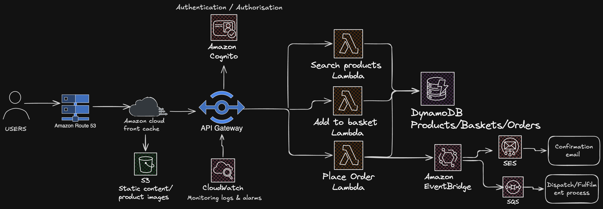

# ecommerce-traditional-vs-serverless
Comparing traditional server-based and serverless AWS architectures for a scalable e-commerce application.

## Project Overview
The purpose of this project was to design and compare two different architectures for an e-commerce application: a traditional server-based architecture and a serverless architecture using AWS services.

The aim was to understand the trade-offs between the two approaches, including differences in cost, scaling, fault detection, maintenance and management. I also explored how each architecture responds when errors or failures occur, what parts of the application could be affected, and how each design would handle changes in traffic and demand.

By comparing both approaches, I was able to understand why the choice of architecture depends on the requirements of the application rather than one approach simply being better than the other.

## Traditional Architecture

The traditional architecture uses multiple server-based components to handle traffic and run the e-commerce application.

A user first accesses the application through Amazon Route 53, which provides DNS routing and directs the request towards the application. Amazon CloudFront is then used as a content delivery network (CDN), caching content closer to users so that frequently requested content can be delivered with lower latency.

Incoming traffic is distributed across the web servers using an Application Load Balancer. This prevents a single web server from receiving all of the traffic and helps the application remain available as demand increases.

The web tier then communicates with the application tier through an internal load balancer, which distributes requests across the application servers. These servers handle the backend processing required by the e-commerce application.

The application servers communicate with the database to store and retrieve application data. A cache is also used for frequently accessed data, reducing the need to repeatedly retrieve the same information directly from the database. Amazon S3 provides object storage for content such as product images, documents and other files.

To handle changes in demand, the web servers and application servers are placed within Auto Scaling Groups. Amazon CloudWatch monitors metrics and can trigger scaling policies when defined thresholds are reached. The Auto Scaling Groups can then add or remove EC2 instances depending on the amount of capacity required.

This architecture provides greater control over the underlying servers and infrastructure, but it also requires more infrastructure to be managed and monitored compared with the serverless design.

## Serverless Architecture

The serverless architecture replaces the traditional web and application server tiers with managed AWS services that can respond to requests and events without requiring the same level of server management.

A user first accesses the application through Amazon Route 53, which provides DNS routing. The request then reaches Amazon CloudFront, which acts as a content delivery network (CDN) and can cache content closer to users to reduce latency.

Amazon S3 is used to store static content such as product images and other files, while CloudFront can cache and deliver this content efficiently to users.

Dynamic application requests are sent through Amazon API Gateway, which acts as the entry point for the backend API and routes requests to the appropriate AWS Lambda function.

The backend is divided into separate Lambda functions for searching products, adding products to a basket, and placing an order. Each function performs a specific task and runs in response to the relevant request or event.

Amazon Cognito is used for authentication and authorisation, helping to verify users before they access protected application functionality.

Amazon DynamoDB stores the main application data, including products, baskets and orders.

When an order is placed, the Place Order Lambda can generate an event that is sent to Amazon EventBridge. EventBridge then routes the event to other services. Amazon SES (Simple Email Service) can send an order confirmation email, while Amazon SQS (Simple Queue Service) can queue fulfilment work so that dispatch processes can handle orders asynchronously.

Amazon CloudWatch provides monitoring, logs and alarms for the serverless application.

This design reduces the amount of infrastructure that needs to be directly managed and allows services such as Lambda and DynamoDB to scale automatically as demand changes.

## Traditional vs Serverless Comparison

### Scaling

Both architectures can scale, but they achieve this in different ways.

In the traditional architecture, Amazon CloudWatch can monitor metrics and trigger scaling policies when defined thresholds are reached. The Auto Scaling Groups can then add additional EC2 instances to the web and application tiers. This is horizontal scaling because additional servers are being added rather than increasing the resources of an individual server.

In the serverless architecture, services such as AWS Lambda can automatically respond to increases in demand. As more requests or events occur, Lambda can handle more concurrent executions without the engineering team having to manage a fleet of servers directly.

For sudden and unpredictable increases in traffic, such as a Black Friday sale, I would favour the serverless architecture because AWS manages more of the scaling automatically.

### Cost

The traditional architecture can have a higher baseline cost because provisioned resources such as EC2 instances can continue running even during periods of low traffic. Auto Scaling can reduce unnecessary capacity, but some infrastructure may still need to remain available.

The serverless architecture uses a more consumption-based model. Services such as Lambda charge based on usage rather than requiring the same type of continuously running server capacity.

For an application with low or unpredictable traffic, I would therefore favour serverless from a cost perspective. However, serverless is not automatically cheaper for every workload, particularly where traffic is consistently high and predictable.

### Performance

Traditional architecture can provide more predictable latency because the servers are already provisioned and running.

AWS Lambda can experience a cold start when AWS needs to initialise a new execution environment. This can introduce additional latency for some requests.

For workloads where consistently low latency is a major requirement, I would therefore consider the traditional architecture.

### Fault Tolerance and Fault Isolation

The traditional architecture uses multiple EC2 instances across two Availability Zones to improve availability.

If an individual web server fails, the Application Load Balancer can stop routing traffic to the unhealthy instance and continue distributing requests across the remaining healthy servers. The Auto Scaling Group can then launch a replacement instance to restore the desired capacity.

Using multiple Availability Zones also means that the application has infrastructure available in another Availability Zone if one Availability Zone experiences a failure.

The serverless architecture provides fault isolation by separating application functionality into individual Lambda functions.

For example, if the Add to Basket Lambda develops a fault, the Search Products and Place Order functions may continue operating independently, provided they do not depend on the failed functionality or another shared dependency.

AWS manages the underlying Lambda infrastructure, but the engineering team is still responsible for identifying and fixing problems within its own application code.

### Management and Maintenance

The traditional architecture requires more ongoing infrastructure management. The engineering team has responsibility for areas such as EC2 instances, operating system patching, server configuration, capacity planning, scaling configuration and instance health.

The serverless architecture reduces this operational overhead because AWS manages more of the underlying infrastructure.

The engineering team is still responsible for its application code, IAM permissions, security, monitoring and service configuration, but it does not have to manage fleets of web and application servers in the same way.

### Deployment

Serverless functions can be deployed independently.

For example, changes to the Place Order Lambda can be deployed without necessarily changing the Search Products or Add to Basket functions.

In a traditional architecture, functionality may be part of a larger application running across multiple application servers, which can make deployments more involved.

### Workload Suitability

I would favour serverless for applications with unpredictable traffic, event-driven workloads, rapid scaling requirements, or teams that want to reduce the amount of infrastructure they manage.

I would favour traditional architecture for workloads that require greater control over the underlying infrastructure, consistently low latency, or long-running processes that are not suitable for a single Lambda invocation.

## Key Learnings

Through this project, I developed a better understanding of:

- Traditional server-based and serverless architecture
- Horizontal and vertical scaling
- EC2 Auto Scaling Groups
- Application Load Balancers
- Multi-AZ high availability
- Caching and shared session storage
- Amazon CloudFront and content delivery
- Amazon S3 object storage
- AWS Lambda and event-driven architecture
- Amazon API Gateway
- Amazon DynamoDB
- Amazon Cognito authentication and authorisation
- Amazon EventBridge
- Amazon SQS and asynchronous processing
- Amazon SES
- Amazon CloudWatch monitoring, logs and alarms
- Fault tolerance and fault isolation
- Cost, performance and operational trade-offs between different architecture approaches

The main lesson I took from this project is that there is no single architecture that is best for every application. The appropriate design depends on factors such as traffic patterns, performance requirements, cost, workload type, operational capacity and the level of infrastructure control required.

